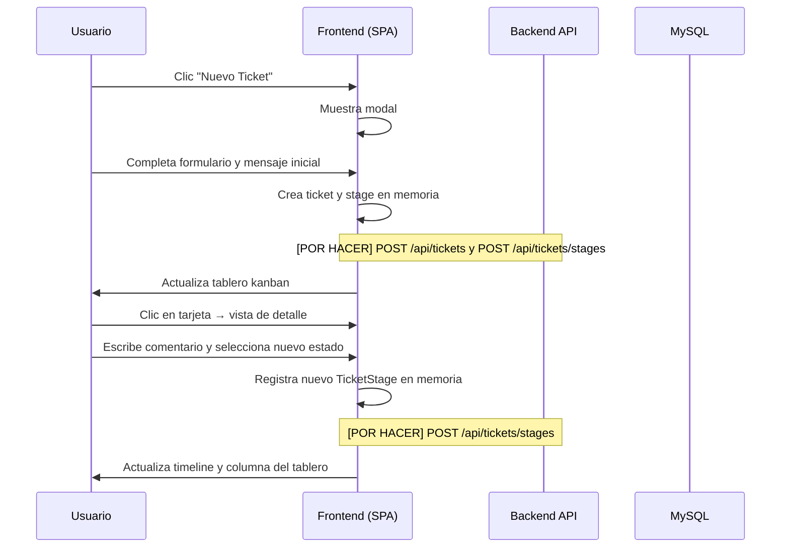
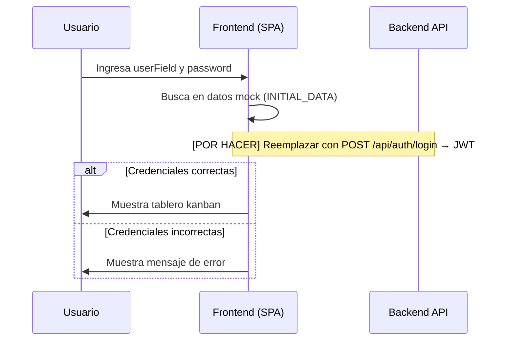
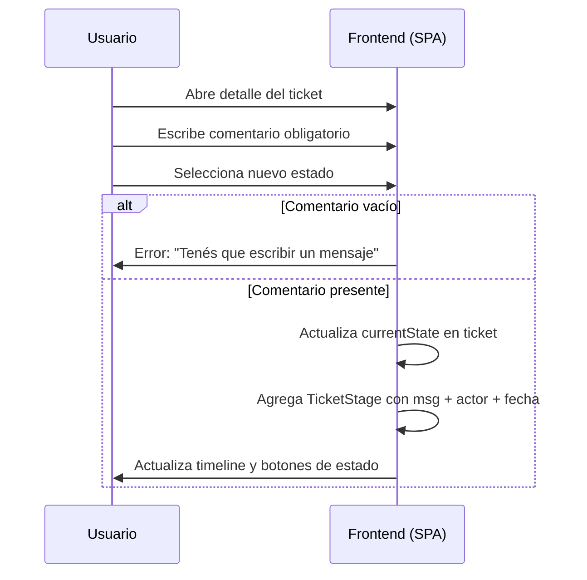

# Spec Funcional — Toba

> **Audiencia:** PMs, stakeholders, nuevos integrantes del equipo, anyone que necesite entender QUÉ hace este sistema y POR QUÉ.
> **Generada:** 2026-05-04 via reverse-SDD
> **Leyenda:** `[INFERRED]` deducido del código · `[ASSUMPTION]` asunción a validar · `[CONFIRMED]` confirmado por el usuario

---

## 1. Propósito

[INFERRED] Toba es una herramienta interna de gestión de proyectos de software estilo kanban. Permite a equipos de desarrollo registrar proyectos, organizar tickets de trabajo por estado, y llevar un historial auditado de cambios con comentarios obligatorios. Está orientada a equipos técnicos pequeños y medianos.

## 2. Usuarios y actores

- **Project Manager** — crea y administra proyectos, asigna equipos, tiene visibilidad de todos los proyectos de su equipo.
- **Miembro de equipo** (Dev, QA, BA, Team Leader, etc.) — visualiza y gestiona tickets de los proyectos de su equipo, registra avances y transiciones de estado.
- **Sistema (futuro)** — [POR HACER] un módulo de autenticación JWT que valide credenciales en el backend antes de dar acceso.

## 3. Casos de uso principales

### CU-01: Login

**Quién:** cualquier usuario registrado
**Qué:** acceder al sistema con credenciales de usuario (userField + contraseña)
**Flujo:**
1. Usuario ingresa userField y contraseña en el formulario de login.
2. Sistema verifica las credenciales.
3. Si son correctas, redirige al tablero kanban; si no, muestra mensaje de error.

**Nota:** [CONFIRMED] actualmente la verificación ocurre solo en el frontend con datos mock. [POR HACER] reemplazar con llamada al backend.

**Reglas asociadas:** RN-07

---

### CU-02: Ver tablero Kanban

**Quién:** usuario autenticado
**Qué:** visualizar tickets del proyecto seleccionado organizados por columnas de estado
**Flujo:**
1. Usuario selecciona un proyecto desde el dropdown (solo ve proyectos de su equipo).
2. Sistema muestra cuatro columnas: OPEN / IN_PROGRESS / RESOLVED / CLOSED.
3. Cada columna muestra las tarjetas de ticket con topic, prioridad, ID (TBA-{n}) y avatar del último actor.

**Reglas asociadas:** RN-01, RN-02

---

### CU-03: Crear ticket

**Quién:** usuario autenticado con acceso a al menos un proyecto
**Qué:** registrar un nuevo ticket en un proyecto de su equipo
**Flujo:**
1. Usuario abre el modal "Nuevo Ticket".
2. Ingresa topic, prioridad, estado inicial, proyecto destino y un mensaje de apertura obligatorio.
3. Sistema crea el ticket y registra el primer TicketStage en el historial.
4. El tablero kanban se actualiza con la nueva tarjeta.

**Reglas asociadas:** RN-03, RN-04

---

### CU-04: Ver detalle y transicionar estado de un ticket

**Quién:** usuario autenticado con acceso al proyecto del ticket
**Qué:** cambiar el estado de un ticket dejando un comentario obligatorio
**Flujo:**
1. Usuario hace clic en una tarjeta del tablero.
2. Sistema muestra el detalle: topic, estado actual, historial de stages ordenado cronológicamente, y panel lateral con proyecto, prioridad, equipos asignados y fecha de creación.
3. Usuario escribe un comentario en el área de texto.
4. Usuario selecciona el nuevo estado.
5. Sistema registra el cambio como un nuevo TicketStage con el mensaje, el actor y la fecha.

**Reglas asociadas:** RN-03, RN-05

---

### CU-05: Crear proyecto (solo PROJECT_MANAGER)

**Quién:** usuario con rol PROJECT_MANAGER
**Qué:** registrar un nuevo proyecto y asignarle uno o más equipos
**Flujo:**
1. PM abre el modal "Nuevo Proyecto" (botón solo visible para PROJECT_MANAGER).
2. Ingresa nombre, descripción, estado inicial y selecciona los equipos asignados.
3. Sistema crea el proyecto con los equipos indicados.

**Reglas asociadas:** RN-06

---

### CU-06: Ver métricas de proyectos

**Quién:** usuario autenticado
**Qué:** obtener una vista agregada del estado de los proyectos y tickets visibles
**Flujo:**
1. Usuario navega a la vista "Proyectos".
2. Sistema muestra métricas globales: total de tickets, en progreso, resueltos y cerrados.
3. Por cada proyecto visible, muestra descripción, barra de progreso (resueltos+cerrados / total), conteo por estado y los equipos y miembros asignados.

---

### CU-07: Ver información del equipo

**Quién:** usuario autenticado
**Qué:** ver los miembros, roles y proyectos del equipo propio
**Flujo:**
1. Usuario navega a la vista "Equipos".
2. Sistema muestra una tabla con nombre, mail y rol de cada miembro del equipo al que pertenece el usuario, junto con los proyectos asignados a ese equipo.

---

## 4. Reglas de negocio

- **RN-01:** [INFERRED] Un usuario solo puede ver proyectos y tickets de los proyectos asignados al equipo al que pertenece.
- **RN-02:** [INFERRED] Un usuario solo puede ver el equipo al que él mismo pertenece.
- **RN-03:** [INFERRED] Para cambiar el estado de un ticket es obligatorio redactar un mensaje/comentario (campo no puede estar vacío).
- **RN-04:** [INFERRED] Un ticket debe pertenecer siempre a un proyecto existente; `projectId` no puede ser nulo.
- **RN-05:** [INFERRED] Los estados de un ticket siguen el ciclo OPEN → IN_PROGRESS → RESOLVED → CLOSED. El sistema no valida transiciones hacia atrás, pero el flujo esperado es el ascendente.
- **RN-06:** [INFERRED] Solo un usuario con rol `PROJECT_MANAGER` puede crear nuevos proyectos; el botón de creación solo aparece para ese rol.
- **RN-07:** [ASSUMPTION] Las credenciales (userField + password) son únicas por usuario. No se valida unicidad de `userField` a nivel de BD.

## 5. Flujos clave

### Flujo: Crear ticket y registrar un cambio de estado

### Flujo: Login

### Flujo: Transición de estado con historial auditado

## 6. Estados y transiciones

### Entidad: Ticket (TicketState)

| Estado | Descripción | Transiciones esperadas |
|--------|-------------|------------------------|
| `OPEN` | Ticket creado, trabajo no iniciado | → `IN_PROGRESS` |
| `IN_PROGRESS` | En desarrollo activo | → `RESOLVED`, `CLOSED` |
| `RESOLVED` | Trabajo terminado, pendiente de revisión final | → `CLOSED`, `IN_PROGRESS` (reapertura) |
| `CLOSED` | Cerrado definitivamente | [INFERRED] punto final, sin transiciones |

Nota: [INFERRED] el modelo actual no valida transiciones — cualquier estado puede setearse desde el frontend. La restricción es solo convención de equipo.

### Entidad: Project (ProjectStatus)

| Estado | Descripción |
|--------|-------------|
| `ACTIVE` | En curso activo |
| `ON_HOLD` | Pausado temporalmente |
| `ENDED` | Proyecto finalizado |
| `ARCHIVED` | Archivado (sin actividad) |

## 7. Out of scope

- No gestiona notificaciones ni alertas (email, Slack, etc.).
- No tiene integración con herramientas de versionado (GitHub, GitLab, etc.).
- [INFERRED] No soporta sub-tareas dentro de un ticket.
- No tiene gestión de sprints, iteraciones ni roadmaps.
- No tiene panel de administración de usuarios (alta/baja de usuarios vía UI).

## 8. Glosario de dominio

- **Ticket:** unidad de trabajo registrable con topic, prioridad y estado actual.
- **TicketStage:** registro histórico de un cambio de estado de un ticket. Incluye mensaje del actor, estado resultante y fecha.
- **Project:** proyecto de trabajo al que se asignan equipos y que agrupa tickets.
- **Team:** grupo de usuarios con un tipo de especialización (DATA, DEVOPS, MANAGEMENT, DEVELOPMENT).
- **PROJECT_MANAGER:** rol especial que puede crear proyectos y tiene visibilidad sobre los del equipo.
- **Kanban:** vista del tablero organizada en columnas por TicketState.
- **TBA-{n}:** identificador visible de un ticket en la UI (TBA + id numérico).

## 9. Asunciones a validar

- [ ] ASSUMPTION: El sistema es de uso interno (equipo de desarrollo propio), no expuesto a usuarios finales de clientes.
- [ ] ASSUMPTION: El modelo de acceso "un usuario ve solo proyectos de su equipo" es el modelo definitivo de permisos, sin permisos individuales por usuario.
- [ ] ASSUMPTION: Las transiciones de estado no requieren validación estricta de flujo (cualquier estado puede pasar a cualquier otro, no solo el siguiente en el ciclo).
- [ ] ASSUMPTION: Las credenciales (userField) son únicas por usuario — no se valida en código ni en BD.
- [ ] ASSUMPTION: No hay límite de usuarios con rol PROJECT_MANAGER por equipo.
