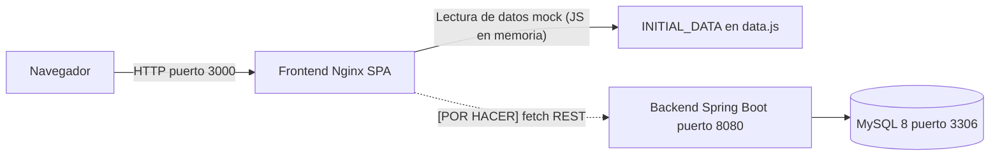

# Spec Técnica — Toba

> **Audiencia:** Desarrolladores que tienen que tocar este código.
> **Generada:** 2026-05-04 via reverse-SDD
> **Leyenda:** `[INFERRED]` deducido del código · `[ASSUMPTION]` asunción a validar · `[CONFIRMED]` confirmado por el usuario

---

## 1. Resumen técnico

Toba es un sistema de gestión de tickets compuesto por una API REST en Spring Boot 4.0.5 (Java 17) con persistencia en MySQL 8, y un frontend SPA en HTML/CSS/JS vanilla servido por Nginx. El sistema se levanta íntegramente con Docker Compose. [CONFIRMED] La integración back-front aún no está implementada — el frontend opera con datos mock hardcodeados en memoria.

## 2. Stack y versiones

| Componente | Tecnología | Versión | Notas |
|------------|------------|---------|-------|
| Lenguaje (backend) | Java | 17 | |
| Framework backend | Spring Boot | 4.0.5 | spring-boot-starter-webmvc |
| ORM | Spring Data JPA / Hibernate | [INFERRED] 6.x | por Spring Boot 4 |
| Base de datos | MySQL | 8 | |
| Gestor de deps backend | Maven | [INFERRED] 3.x | pom.xml |
| Utilidades backend | Lombok | 1.x | generación de código compile-time |
| Validación | Jakarta Bean Validation | [INFERRED] 3.x | @NotBlank, @NotNull |
| Frontend | HTML5 / CSS3 / JS ES6+ | — | Sin framework |
| Web server frontend | Nginx | [INFERRED] latest | sirve static files |
| Contenedores | Docker + Docker Compose | — | |

## 3. Arquitectura

### 3.1 Estilo arquitectónico

Backend: arquitectura en capas clásica (Controller → Service → Repository → Entity). No hay capa de dominio separada; la lógica de negocio vive en los `ServiceImpl`. Frontend: SPA de fichero único sin framework, con estado global mutable en variables globales en `state.js` y datos mock en `data.js`.

### 3.2 Estructura de carpetas

```
toba_project/
├── Docker-Compose.yaml              # orquestación de los 3 servicios
├── env.example                      # variables de entorno requeridas
└── app/
    ├── tobaBack/                    # Spring Boot
    │   └── src/main/java/com/toba/toba/
    │       ├── config/              # CorsConfig (CORS + env ALLOWED_ORIGINS)
    │       ├── controller/          # REST controllers (4: User, Team, Project, Ticket)
    │       ├── dto/                 # Request/Response DTOs (Java records)
    │       │   ├── projectDtos/
    │       │   ├── teamDtos/
    │       │   ├── ticketDos/       # typo en carpeta (dos vs dtos)
    │       │   ├── ticketStageDtos/
    │       │   └── userDtos/
    │       ├── entities/            # JPA entities + enums/
    │       ├── exception/           # GlobalExceptionHandler + ResourceNotFoundException
    │       ├── mapper/              # Mappers estáticos (entity ↔ DTO)
    │       ├── repository/          # JpaRepository interfaces
    │       └── service/             # interfaces + impl/
    └── tobaFront/                   # SPA vanilla
        ├── index.html               # entrypoint único del SPA
        ├── css/
        │   ├── variables.css        # design tokens (colores, tipografía, etc.)
        │   ├── base.css             # reset + estilos base
        │   └── components.css       # componentes UI (kanban, cards, modals, etc.)
        ├── js/
        │   ├── data.js              # INITIAL_DATA mock (usuarios, proyectos, tickets)
        │   ├── state.js             # estado reactivo + helpers de dominio
        │   └── app.js               # handlers DOM + funciones de renderizado
        ├── nginx.conf               # configuración Nginx
        └── Dockerfile
```

### 3.3 Diagrama de componentes



## 4. Modelo de datos

### 4.1 Entidades principales

#### `User`
- **Propósito:** persona del sistema con un rol asignado.
- **Atributos clave:** `id`, `name`, `surname`, `mail`, `role` (RoleEnum), `team_id`
- **Relaciones:** ManyToOne → `Team`; OneToOne (cascade ALL) → `Adress`; OneToOne (cascade ALL) → `Credentials`

#### `Credentials`
- **Propósito:** almacenar credenciales de autenticación del usuario.
- **Atributos clave:** `id`, `userField` (username), `password` (**texto plano — [POR HACER] implementar hashing**), `lastLogin`
- **Relaciones:** OneToOne ← `User`

#### `Adress` (typo — debería ser `Address`)
- **Propósito:** dirección física opcional del usuario.
- **Atributos clave:** `street`, `zipCode`, `houseNumber`
- **Relaciones:** OneToOne ← `User`

#### `Team`
- **Propósito:** grupo de usuarios con una especialización.
- **Atributos clave:** `id`, `name`, `teamType` (TeamType: DATA, DEVOPS, MANAGEMENT, DEVELOPMENT)
- **Relaciones:** OneToMany → `User`; OneToMany → `TeamProject`

#### `Project`
- **Propósito:** proyecto de trabajo al que se asignan equipos y tickets.
- **Atributos clave:** `id`, `name`, `description`, `startDate`, `status` (ProjectStatus)
- **Relaciones:** OneToMany → `Ticket`; OneToMany → `TeamProject`

#### `TeamProject`
- **Propósito:** tabla de unión N:M entre `Team` y `Project`.
- **Atributos clave:** `id`, `team_id`, `project_id`
- **Relaciones:** ManyToOne → `Team`; ManyToOne → `Project`

#### `Ticket`
- **Propósito:** unidad de trabajo trackeable dentro de un proyecto.
- **Atributos clave:** `id`, `topic`, `priority` (PriorityEnum: TRIVIAL, LOW, MEDIUM, HIGH, CRITICAL, BLOCKER), `currentState` (TicketState: OPEN, IN_PROGRESS, RESOLVED, CLOSED), `project_id`
- **Relaciones:** ManyToOne → `Project`; OneToMany → `TicketStage`

#### `TicketStage`
- **Propósito:** registro histórico inmutable de un cambio de estado en un ticket.
- **Atributos clave:** `id`, `msg`, `createTime` (@CreationTimestamp), `state`, `ticket_id`, `user_id`
- **Relaciones:** ManyToOne → `Ticket`; ManyToOne → `User`

### 4.2 Esquema

[INFERRED] El esquema se genera automáticamente por Hibernate DDL auto. Tablas principales: `app_user`, `credentials`, `adress`, `team`, `project`, `team_project`, `ticket`, `ticket_stage`. La tabla de usuario se llama `app_user` para evitar colisión con la keyword `user` en MySQL.

### 4.3 Migraciones

[INFERRED] No hay sistema de migraciones (sin Flyway ni Liquibase). El esquema se crea vía `spring.jpa.hibernate.ddl-auto`. **[POR HACER]** Agregar Flyway o Liquibase antes de usar en cualquier entorno con datos reales.

## 5. Superficie de API

### 5.1 Endpoints HTTP

| Método | Ruta | Propósito | Auth |
|--------|------|-----------|------|
| `GET` | `/api/users` | Listar todos los usuarios | Sin auth implementada |
| `GET` | `/api/users/{id}` | Obtener usuario por ID | Sin auth implementada |
| `POST` | `/api/users` | Crear usuario | Sin auth implementada |
| `PUT` | `/api/users/{id}` | Actualizar usuario completo | Sin auth implementada |
| `DELETE` | `/api/users/{id}` | Eliminar usuario | Sin auth implementada |
| `GET` | `/api/teams` | Listar equipos | Sin auth implementada |
| `GET` | `/api/teams/{id}` | Obtener equipo por ID | Sin auth implementada |
| `POST` | `/api/teams` | Crear equipo | Sin auth implementada |
| `PUT` | `/api/teams/{id}` | Actualizar equipo | Sin auth implementada |
| `DELETE` | `/api/teams/{id}` | Eliminar equipo | Sin auth implementada |
| `GET` | `/api/projects` | Listar proyectos | Sin auth implementada |
| `GET` | `/api/projects/{id}` | Obtener proyecto por ID | Sin auth implementada |
| `POST` | `/api/projects` | Crear proyecto | Sin auth implementada |
| `PUT` | `/api/projects/{id}` | Actualizar proyecto | Sin auth implementada |
| `DELETE` | `/api/projects/{id}` | Eliminar proyecto | Sin auth implementada |
| `GET` | `/api/tickets` | Listar tickets | Sin auth implementada |
| `GET` | `/api/tickets/{id}` | Obtener ticket por ID | Sin auth implementada |
| `POST` | `/api/tickets` | Crear ticket (requiere projectId) | Sin auth implementada |
| `PUT` | `/api/tickets/{id}` | Actualizar ticket | Sin auth implementada |
| `DELETE` | `/api/tickets/{id}` | Eliminar ticket | Sin auth implementada |
| `POST` | `/api/tickets/stages` | Agregar stage a un ticket | Sin auth implementada |
| `GET` | `/api/tickets/stages/{id}` | Obtener stage por ID | Sin auth implementada |

**[POR HACER]** Agregar endpoint de autenticación: `POST /api/auth/login` (o equivalente JWT).

### 5.2 Autenticación / Autorización

**[POR HACER]** No hay Spring Security ni JWT implementados. Todos los endpoints son públicos. La única capa de seguridad presente es CORS configurado en `CorsConfig.java` leyendo `ALLOWED_ORIGINS` desde variable de entorno. La autenticación existe solo en el frontend (validación de credenciales contra mock data en JS).

Pendiente:
- Agregar Spring Security + JWT filter chain.
- Crear endpoint `POST /api/auth/login` que devuelva token.
- Proteger todos los endpoints `/api/**` con `@PreAuthorize` o equivalente.
- Implementar RBAC: validar `PROJECT_MANAGER` en endpoints de creación de proyectos desde el backend.

### 5.3 Contratos / DTOs

DTOs implementados como **Java records** en el paquete `dto/`. Validación con `@NotBlank` y `@NotNull`. El `GlobalExceptionHandler` maneja:
- `ResourceNotFoundException` → 404 con body `{"message": "..."}`.
- `IllegalArgumentException` → 400 con body `{"message": "..."}`.

**[POR HACER]** No se captura `MethodArgumentNotValidException` (errores de `@Valid`). Cuando falla una validación de Bean Validation, Spring devuelve un 400 con body no estructurado. Hay que agregar el handler correspondiente.

## 6. Dependencias externas

### 6.1 Servicios externos

- **MySQL 8** — base de datos relacional principal. Consumida por Spring Data JPA vía JDBC.

### 6.2 Librerías críticas

- `spring-boot-starter-webmvc` — framework HTTP y MVC.
- `spring-boot-starter-data-jpa` — ORM sobre Hibernate.
- `spring-boot-starter-validation` — Bean Validation (Jakarta).
- `spring-boot-starter-session-jdbc` — gestión de sesiones vía JDBC. [ASSUMPTION] incluida como preparación para auth basada en sesión, actualmente sin uso activo.
- `mysql-connector-j` — driver JDBC para MySQL.
- `lombok` — reduce boilerplate (getters/setters/constructores/builders).

## 7. Configuración

Variables de entorno requeridas (ver `env.example`):

| Variable | Propósito | Ejemplo |
|----------|-----------|---------|
| `APP_PORT` | Puerto expuesto del backend | `8080` |
| `DB_HOST` | Hostname de la BD | `db` (en Docker) |
| `DB_USER` | Usuario MySQL | `toba` |
| `DB_PASS` | Contraseña MySQL | — |
| `DB_PORT` | Puerto MySQL | `3306` |
| `ALLOWED_ORIGIN` | Origen permitido en CORS | `http://localhost:3000` |

## 8. Decisiones técnicas y trade-offs

### TD-01: Java records para DTOs

- **Contexto:** necesidad de estructuras de datos inmutables para requests/responses.
- **Decisión:** se usan Java records (Java 16+) en lugar de clases Lombok.
- **Trade-off:** más conciso y seguro (inmutabilidad); más rígido para validaciones complejas sobre propiedades anidadas.
- **Status:** [INFERRED]

### TD-02: Mappers estáticos (sin MapStruct)

- **Contexto:** transformación entre entidades y DTOs.
- **Decisión:** clases con métodos estáticos manuales en lugar de MapStruct u otro generador.
- **Trade-off:** control total del mapeo; más código boilerplate a mantener manualmente cuando cambian entidades o DTOs.
- **Status:** [INFERRED]

### TD-03: Frontend vanilla (sin framework)

- **Contexto:** construcción de la UI del kanban.
- **Decisión:** HTML/CSS/JS puro, sin React/Vue/Angular.
- **Trade-off:** cero dependencias de npm, fácil de arrancar y entender; difícil de escalar y mantener conforme crezca la UI por la falta de componentes reutilizables y data binding.
- **Status:** [INFERRED]

### TD-04: Estado en memoria en el frontend (mock data)

- **Contexto:** la integración back-front no estaba lista al momento del desarrollo de la UI.
- **Decisión:** todos los datos se leen de `INITIAL_DATA` hardcodeado en `data.js`.
- **Trade-off:** permite desarrollar y testear la UI sin necesidad del backend; los datos no persisten (se pierden al recargar) y el login es solo visual.
- **Status:** [CONFIRMED] (comentario explícito en `app.js`: "Sustituir lecturas de appState por fetch() a Spring Boot cuando corresponda")

### TD-05: Docker Compose como entorno de desarrollo

- **Contexto:** necesidad de levantar tres servicios (DB, backend, frontend) coordinadamente.
- **Decisión:** Docker Compose con healthcheck en MySQL antes de arrancar el backend.
- **Trade-off:** simple para desarrollo local; no contempla estrategias de producción (orquestación, escalado, secretos).
- **Status:** [INFERRED]

## 9. Deployment y runtime

- **Cómo se buildea:** `mvn package` para el backend (Dockerfile en `tobaBack/`); frontend sirve archivos estáticos desde Nginx.
- **Cómo corre:** `docker compose up` (requiere archivo `.env` basado en `env.example`).
- **Dónde corre:** [ASSUMPTION] solo entorno local/desarrollo. No se detectó configuración de staging o producción.
- **CI/CD:** No se detectó pipeline de CI/CD (sin `.github/workflows`, sin `.gitlab-ci.yml`, sin `Jenkinsfile`). **[POR HACER]** configurar pipeline básico con build + test.

## 10. Observabilidad

- **Logging:** Spring Boot default (SLF4J + Logback, plain text a stdout en Docker).
- **Métricas:** No se detectó instrumentación (sin Micrometer, sin Prometheus, sin OpenTelemetry).
- **Tracing:** No se detectó.
- **Health checks:** Docker Compose incluye healthcheck de MySQL (`mysqladmin ping`). No hay endpoint `/actuator/health` en el backend ([INFERRED] `spring-boot-starter-actuator` no está incluido en el `pom.xml`).

## 11. Testing

- **Frameworks:** JUnit (via Spring Boot test starter).
- **Tipos de test presentes:** Solo un test de carga de contexto (`TobaApplicationTests.java`).
- **Cobertura observable:** Prácticamente nula — un único test de smoke.
- **Cómo correr:** `mvn test`

**[POR HACER]** Agregar tests unitarios para los `ServiceImpl` y tests de integración para los controllers.

## 12. Gaps técnicos detectados

- **[POR HACER] Integración front-back:** el frontend no consume la API REST. Todo corre con datos mock en `data.js`. Los comentarios en el código indican explícitamente que hay que reemplazar con `fetch()`.
- **[POR HACER] Autenticación JWT:** no hay Spring Security ni endpoint de login. Todos los endpoints son públicos. Cualquier persona con acceso al puerto 8080 puede leer y mutar todos los datos.
- **[POR HACER] Hash de contraseñas:** `Credentials.password` se almacena en texto plano en MySQL. Crítico — debe resolverse antes de cualquier uso con datos reales. Implementar BCrypt o similar.
- **[POR HACER] RBAC en el backend:** el rol `PROJECT_MANAGER` solo se verifica en el frontend JS. El backend no valida permisos por rol en ningún endpoint.
- **[POR HACER] Handler de MethodArgumentNotValidException:** `GlobalExceptionHandler` no captura los errores de validación de `@Valid`. Cuando falla una validación, la respuesta no tiene el formato JSON esperado.
- **[POR HACER] Validación de formato de email:** `UserRequestDto.mail` usa `@NotBlank` pero no `@Email`. Acepta cualquier cadena no vacía como email válido.
- **[POR HACER] Endpoint de autenticación:** no existe `POST /api/auth/login` ni equivalente en el backend.
- **[POR HACER] Sistema de migraciones:** no hay Flyway ni Liquibase. El esquema se regenera con DDL auto de Hibernate. Esto es peligroso con datos reales.
- **[POR HACER] Tests:** cobertura prácticamente nula. Solo el context load test existe.
- **Typo en entidad y carpeta:** `Adress` debería ser `Address`. Se propaga a la columna de BD (`adress_id`), al DTO y a los mappers. Corregir antes de tener datos persistidos o implica una migración.
- **Typo en nombre de carpeta:** `dto/ticketDos/` debería ser `dto/ticketDtos/`.
- **[INFERRED] spring-boot-starter-session-jdbc sin uso activo:** posiblemente preparación para auth basada en sesión que nunca se completó.

## 13. Asunciones a validar

- [ ] ASSUMPTION: El entorno destino es solo desarrollo local/staging. No se detectó configuración de producción.
- [ ] ASSUMPTION: `spring-boot-starter-session-jdbc` fue incluido como preparación para autenticación basada en sesión, pero no está implementado activamente.
- [ ] ASSUMPTION: El typo `Adress` en la entidad es un error y no un nombre de dominio intencional.
- [ ] ASSUMPTION: No hay CI/CD porque el proyecto está en etapa temprana de desarrollo.
- [ ] ASSUMPTION: `spring.jpa.hibernate.ddl-auto` está configurado en `create` o `update` para el entorno de desarrollo (no se leyó `application.properties`).
